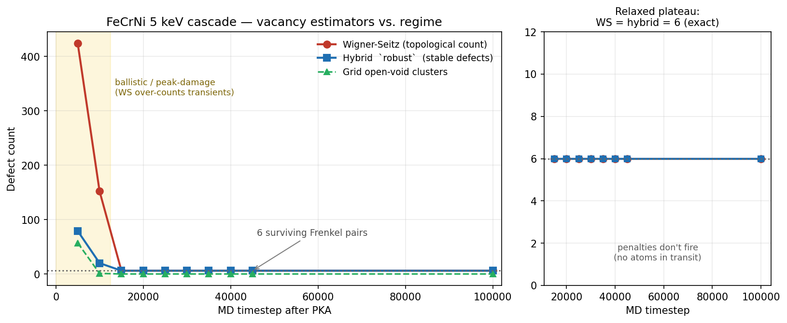

# DistributionTool

A C++17 command-line tool for semi-automatic identification and classification of defects in crystalline solids from LAMMPS molecular dynamics simulations. Based on the SOAP descriptor approach of Domínguez-Gutiérrez & von Toussaint and the FaVaD workflow (von Toussaint et al., 2020).

---

## Table of Contents

1. [Physical background](#1-physical-background)
2. [Method overview](#2-method-overview)
3. [Mathematical formulation](#3-mathematical-formulation)
   - 3.1 [SOAP descriptor](#31-soap-descriptor)
   - 3.2 [Radial basis functions](#32-radial-basis-functions)
   - 3.3 [Spherical harmonics](#33-spherical-harmonics)
   - 3.4 [Distance metric and probability model](#34-distance-metric-and-probability-model)
   - 3.5 [Defect classification](#35-defect-classification)
   - 3.6 [Vacancy detection — sampling grid](#36-vacancy-detection--sampling-grid)
   - 3.7 [Vacancy detection — Wigner-Seitz](#37-vacancy-detection--wigner-seitz)
   - 3.8 [Vacancy detection — hybrid consensus](#38-vacancy-detection--hybrid-consensus)
   - 3.9 [Regime dependence and method reconciliation](#39-regime-dependence-and-method-reconciliation)
   - 3.10 [Principal Component Analysis](#310-principal-component-analysis)
4. [Code architecture](#4-code-architecture)
5. [Build instructions](#5-build-instructions)
6. [Usage](#6-usage)
7. [Output files](#7-output-files)
8. [Typical workflow](#8-typical-workflow)
9. [Parameter guide](#9-parameter-guide)
10. [References](#10-references)

---

## 1. Physical background

Energetic particle impacts (neutrons, ions) create collision cascades in crystalline materials, leaving behind point defects: **vacancies** (missing atoms), **self-interstitial atoms** (SIAs), and more complex defect clusters. Quantifying this damage is critical for fusion and fission materials research.

Classical approaches (Wigner-Seitz cell, Voronoi tessellation) are exact and parameter-free on relaxed structures, but on hot, peak-damage snapshots they over-count transient displacements as defects, and thermal motion blurs the lattice. This tool therefore offers **both**: the classical Wigner-Seitz count *and* a descriptor-vector (SOAP fingerprint) classifier that is robust to thermal noise and does not require the pristine lattice positions at classification time — unified by a regime-aware hybrid detector that reconciles the two (§3.7–3.9).

---

## 2. Method overview

The tool combines a **descriptor-based atom classifier** (SOAP + chi/empirical
probability) with **three independent vacancy estimators** that the user selects
according to the physical regime of the frame being analysed.

```
LAMMPS dump (pristine)  ──►  Compute SOAP DVs  ──►  Build reference q̄(T)   ──► WS reference sites
                                                           │                          │
LAMMPS dump (damaged)   ──►  Compute SOAP DVs  ──►  Classify atoms (d^i)              │
                                                           │                          │
                            ┌──────────────────────────────┼──────────────────────────┘
                            │                               │
                  Grid vacancies            Wigner-Seitz occupancy        Hybrid consensus
                  (open-void volume)         (topological count)          (multi-signal, regime-aware)
                            │                               │                          │
                            └───────────────►  Vacancy reconciliation report  ◄────────┘
                                                           │
                                                    PCA (optional)
```

1. **Reference frame**: compute descriptor vectors (DVs) for all atoms in the pristine/thermalized crystal; average them to obtain the reference fingerprint $\bar{q}(T)$. Optionally build one reference **per atomic species** (`--per-species`, essential for chemically disordered alloys; see §3.4) and a Wigner-Seitz site index (`--ws`).
2. **Damaged frame**: compute DVs for the irradiated sample; compare each atom to $\bar{q}(T)$.
3. **Classification**: threshold on distance $d^i$; defect probability from either the parametric **chi model** (FaVaD Eq. 6) or a non-parametric **empirical CDF** (`--empirical-prob`); secondary classification by nearest known defect reference.
4. **Vacancy estimation** — three complementary estimators measuring *different* physical quantities (§3.6–3.9):
   - **Sampling grid** (§3.6): open-void / porosity volume, threshold-dependent.
   - **Wigner-Seitz** (§3.7): topological Frenkel-pair count (`--ws`).
   - **Hybrid consensus** (§3.8): regime-aware super-method that fuses six signals and two ballistic penalties (`--hybrid`), reproducing WS exactly under the `ws` preset and filtering transient pairs under `robust`.
5. **Reconciliation**: a summary block prints all three estimators side by side with an explicit caveat that they are not expected to be equal (§3.9).
6. **PCA** (optional): project DVs to 2–3 dimensions; clusters reveal unknown defect geometries.

> **Which vacancy method?** Use **WS or the hybrid `relaxed` preset for cooled/relaxed frames** (they agree exactly), the **hybrid `robust` preset for ballistic / peak-damage snapshots** (it filters transient Frenkel pairs WS over-counts), and the **grid** only as an open-void volume metric — never as a single-vacancy count. See §3.9 for the physical justification and validation data.

---

## 3. Mathematical formulation

### 3.1 SOAP descriptor

The **Smooth Overlap of Atomic Positions** (SOAP) descriptor (Bartók et al., Phys. Rev. B 87, 2013) maps the local atomic environment of atom $i$ onto a rotationally-invariant fingerprint vector.

**Atomic density field**

The local environment of atom $i$ is encoded as a sum of Gaussians centered on neighbours $j$:

$$\rho^i(\mathbf{r}') = \sum_{j \neq i} f_\text{cut}(r_{ij})\, \exp\!\left(-\frac{|\mathbf{r}' - \mathbf{r}_{ij}|^2}{2\sigma^2}\right)$$

where $\sigma$ is the Gaussian width and $f_\text{cut}$ is a smooth cutoff function.

**Expansion coefficients**

The density is expanded in a basis of radial functions $\phi_n(r)$ and real spherical harmonics $Y_l^m(\hat{r})$:

$$c_{nlm}^i = \sum_{j \neq i} \phi_n(r_{ij})\, Y_l^m(\hat{r}_{ij})$$

**Power spectrum (descriptor vector)**

The rotationally-invariant power spectrum combines coefficients at fixed $l$:

$$p_{nn'l}^i = \pi\sqrt{\frac{8}{2l+1}} \sum_{m=-l}^{l} c_{nlm}^i\, c_{n'lm}^i$$

Only the upper triangle $n \leq n'$ is stored, giving a descriptor of size:

$$D = \frac{n_\text{max}(n_\text{max}+1)}{2}\,(l_\text{max}+1)$$

For the default parameters ($n_\text{max} = 9$, $l_\text{max} = 9$): $D = 450$.

**Normalisation**

The descriptor is normalised to the unit sphere:

$$\tilde{q}^i = \frac{p^i}{\|p^i\|}$$

so that distances between DVs lie in $[0, \sqrt{2}]$ and are independent of the number of neighbours.

---

### 3.2 Radial basis functions

The $n_\text{max}$ Gaussian centres are placed equidistantly in $(0,\, r_\text{cut}]$:

$$r_n = \frac{(n+1)\, r_\text{cut}}{n_\text{max}+1}, \quad n = 0, \ldots, n_\text{max}-1$$

Each basis function is:

$$\phi_n(r) = f_\text{cut}(r)\, \exp\!\left(-\frac{(r - r_n)^2}{2\sigma^2}\right)$$

with the cosine smooth cutoff:

$$f_\text{cut}(r) = \begin{cases} \dfrac{1}{2}\!\left(1 + \cos\!\dfrac{\pi r}{r_\text{cut}}\right) & r < r_\text{cut} \\ 0 & r \geq r_\text{cut} \end{cases}$$

If $\sigma$ is not specified by the user ($\sigma = -1$), it defaults to the spacing between centres: $\sigma = r_\text{cut}/(n_\text{max}+1)$.

---

### 3.3 Spherical harmonics

The real (tesseral) spherical harmonics follow the QUIP/libatoms convention:

$$Y_l^0(\hat{r}) = N_{l,0}\, P_l^0(\cos\theta)$$

$$Y_l^m(\hat{r}) = \sqrt{2}\, N_{l,m}\, P_l^m(\cos\theta)\, \cos(m\phi), \quad m > 0$$

$$Y_l^{-m}(\hat{r}) = \sqrt{2}\, N_{l,m}\, P_l^m(\cos\theta)\, \sin(m\phi), \quad m > 0$$

with normalisation:

$$N_{l,m} = \sqrt{\frac{2l+1}{4\pi}\cdot\frac{(l-m)!}{(l+m)!}}$$

Components are stored at index $l^2 + l + m$, giving $(l_\text{max}+1)^2$ values total.

**Implementation (hot path)**

A single-pass Bonnet recurrence computes all $P_l^m$ in $O(l_\text{max}^2)$ operations:

| Step | Formula |
|---|---|
| Diagonal seed | $P_0^0 = 1$ |
| Diagonal advance | $P_{m+1}^{m+1} = -(2m+1)\sin\theta\, P_m^m$ |
| Superdiagonal | $P_{m+1}^m = x(2m+1)\, P_m^m$ |
| General recurrence | $P_l^m = \dfrac{x(2l-1)\,P_{l-1}^m - (l+m-1)\,P_{l-2}^m}{l-m}$ |

The azimuthal angle is handled via a trigonometric recurrence that avoids `atan2` entirely:

$$\cos((m+1)\phi) = \cos(m\phi)\cos\phi - \sin(m\phi)\sin\phi$$

where $\cos\phi = d_x/r_{xy}$, $\sin\phi = d_y/r_{xy}$, $r_{xy} = \sqrt{d_x^2 + d_y^2}$.

This replaces $O(l_\text{max})$ transcendental calls with $O(l_\text{max})$ multiply-adds.

---

### 3.4 Distance metric and probability model

**Distance to reference**

For each atom $i$ in the damaged frame, the distance to the reference fingerprint $\bar{q}(T)$ is:

$$d^i = \|\tilde{q}^i - \bar{q}(T)\|_2$$

where $\bar{q}(T)$ is the arithmetic mean of all DVs in the pristine frame.

**Chi-distribution probability model (FaVaD, Eq. 6)**

The distribution of $d$ values in a thermalized crystal follows a **chi distribution** with $k$ degrees of freedom (corresponding to the number of active DV components):

$$P(d \mid k, \sigma) \propto d^{k-2} \exp\!\left(-\frac{d^2}{2\sigma^2}\right)$$

The distribution has a mode at:

$$d_\text{peak} = \sigma\sqrt{k-2}, \quad k > 2$$

For iron BCC at 300 K the paper reports $k \approx 7$. The tool fits $k$ and $\sigma$ automatically from the reference frame using the method of moments:

$$k = \frac{2\langle d^2 \rangle^2}{\mathrm{Var}(d^2)}, \qquad \sigma = \sqrt{\frac{\langle d^2 \rangle}{k}}$$

The probability is normalised to 1 at the mode:

$$P_\text{norm}(d) = \left(\frac{d}{d_\text{peak}}\right)^{k-2} \exp\!\left(-\frac{d^2 - d_\text{peak}^2}{2\sigma^2}\right)$$

and the defect probability output in the CSV is $1 - P_\text{norm}(d^i)$.

**Per-species references (`--per-species`)**

A single global $\bar{q}(T)$ mixes inequivalent local environments in chemically
disordered systems (high-entropy alloys, ordered compounds). The tool can build a
separate reference $\bar{q}_s(T)$, chi-fit $(k_s,\sigma_s)$ and distance baseline
for each atomic species $s$, with a fallback to the global reference for species
with fewer than 100 atoms (so that tracer atoms — e.g. a single type-4 PKA marker
— do not collapse to a degenerate zero-variance reference):

$$d^i = \|\tilde{q}^i - \bar{q}_{s(i)}(T)\|_2$$

**Empirical (non-parametric) probability (`--empirical-prob`)**

The chi model assumes a monatomic crystal. In a chemically disordered alloy the
distance distribution is *over-dispersed* — the method-of-moments estimate of $k$
falls below its physical floor of 2 because the disorder is intra-species (each
atom sees random-species neighbours), not an inter-species mean shift — so the
chi likelihood is the wrong model. The non-parametric path instead reports the
**percentile rank** of $d^i$ within the sorted reference distances $\{d_\text{ref}\}$
(per species when `--per-species` is on):

$$\text{defect\_prob}(d^i) = \widehat{F}_\text{ref}(d^i) = \frac{\#\{d_\text{ref} \le d^i\}}{N_\text{ref}}$$

For reference-like (lattice) atoms this is approximately uniform on $[0,1]$
(mean $\approx 0.5$); for defects it piles up near 1, giving clean separation.

**Percentile threshold (`--threshold-pct P`)**

Rather than a fixed $\tau$, the primary classification threshold can be set to the
$P$-th percentile of the reference distances (per species), which adapts $\tau$ to
each environment's intrinsic thermal spread:

$$\tau_s = Q_{\{d_\text{ref},s\}}(P/100)$$

> **Recommended for HEAs / disordered alloys:** `--per-species --empirical-prob --threshold-pct 99`. See [`docs/`](docs/) and the project notes for the empirical calibration on the FeCrNi system.

---

### 3.5 Defect classification

**Primary classification**

$$\text{type}^i = \begin{cases} \text{Lattice} & d^i < \tau \\ \text{(secondary)} & d^i \geq \tau \end{cases}$$

where $\tau$ is the user-supplied threshold (default 0.15).

**Secondary classification**

If per-defect reference DVs are provided (via `--ref-sia`, `--ref-antv`, `--ref-typea`), distorted atoms are assigned to the nearest reference:

$$\text{type}^i = \arg\min_{\alpha \in \{\text{SIA, ANtV, TypeA}\}} \|\tilde{q}^i - \tilde{q}^\alpha_\text{ref}\|_2$$

If no reference DVs are provided, all distorted atoms are labelled **Unknown**.

**Defect types**

| Label | Meaning |
|---|---|
| `Lattice` | Regular lattice site; $d^i < \tau$ |
| `Interstitial` | Self-interstitial atom (SIA) |
| `VacancyAdj` | Atom adjacent to a single vacancy (ANtV) |
| `TypeA` | PCA-discovered novel defect type |
| `Unknown` | Distorted but no reference DV available |

---

### 3.6 Vacancy detection — sampling grid

The tool implements the sampling-grid method from FaVaD (§2.3.2). **This estimator
measures open-void volume / porosity, not a single-vacancy count** — see §3.9.

A uniform grid of $N_x \times N_y \times N_z$ points is placed inside the simulation box, with spacing $\Delta$ (default 0.5 Å):

$$N_\alpha = \left\lceil \frac{L_\alpha}{\Delta} \right\rceil, \qquad \alpha \in \{x, y, z\}$$

For each grid point $\mathbf{g}$, the distance to the nearest atom in the damaged frame is computed using the linked-cell algorithm:

$$d_\text{near}(\mathbf{g}) = \min_{j} |\mathbf{g} - \mathbf{r}_j|$$

Grid points with $d_\text{near}(\mathbf{g}) > d_\text{vac}$ are classified as vacancy/void:

$$\mathcal{V} = \{ \mathbf{g} \mid d_\text{near}(\mathbf{g}) > d_\text{vac} \}$$

The estimated void volume is $|\mathcal{V}| \cdot \Delta^3$, which converges as $\Delta \to 0$.

**Advantages over the pristine-lattice approach:**
- Does not require the reference frame for vacancy identification.
- Detects extended voids and crowdion regions, not only single vacancies.
- Volume estimate is grid-refinement consistent.

#### Vacancy clustering

Raw grid points are merged into individual physical vacancy events by a greedy algorithm (FaVaD §2.3.2):

1. Sort all vacant grid points by $d_\text{near}$ in descending order (deepest void first).
2. Take the first unassigned point as the seed of a new cluster.
3. Absorb every remaining unassigned point within $r_\text{cluster}$ (default = $d_\text{vac}$) using minimum-image PBC.
4. Repeat from step 2 until all points are assigned.

Each resulting `VacancyCluster` records:

| Field | Description |
|---|---|
| `center` | Position of the grid point with maximum $d_\text{near}$ in the cluster |
| `d_near_max` | Peak void depth $\max(d_\text{near})$ within the cluster [Å] |
| `n_pts` | Number of grid points merged into this cluster |

The cluster count equals the number of distinct physical vacancies (or void pockets) detected in the frame. The `--vac-cluster-radius` option overrides $r_\text{cluster}$ independently of `--vac-dist`.

---

### 3.7 Vacancy detection — Wigner-Seitz

The classical **Wigner-Seitz (WS)** method (`--ws`) is a *topological*, site-based
estimator. The pristine reference frame defines a set of lattice sites $\{\mathbf{s}_a\}$,
each owning the Wigner-Seitz cell of points closer to it than to any other site.
Every atom $\mathbf{r}_j$ of the damaged frame is assigned to its nearest reference
site (computed in $O(N)$ via a linked-cell index):

$$a(j) = \arg\min_a \|\mathbf{r}_j - \mathbf{s}_a\|$$

The **occupancy** of site $a$ is $o_a = \#\{j : a(j) = a\}$, from which defects are
counted directly:

$$N_\text{vac} = \#\{a : o_a = 0\}, \qquad N_\text{int} = \sum_a \max(0,\, o_a - 1)$$

A site with $o_a = 0$ is a **vacancy**; a cell with $o_a \ge 2$ holds
$o_a - 1$ **interstitials**. Conservation $\sum_a o_a = N_\text{dmg}$ guarantees
$N_\text{vac} - N_\text{int} = N_\text{ref} - N_\text{dmg}$, so in a closed system
vacancies and interstitials appear as balanced **Frenkel pairs**.

**Per-atom label:** an atom whose assigned cell has $o_a = 1$ is `Lattice`;
$o_a \ge 2$ marks it `Interstitial`.

**Strengths and limitations.** WS is exact, parameter-free and the community
standard at 0 K. Its weakness is that it is a *snapshot* counter that treats every
displaced atom as a Frenkel pair — it cannot distinguish a stable defect from an
atom in ballistic transit that will recombine picoseconds later. On a hot
peak-damage frame it therefore **over-counts** transient pairs (§3.9). The
`--ws-r-cut` option sets the cell-search cutoff (default = SOAP `--r-cut`); it must
exceed the largest first-neighbour distance so the $3\times3\times3$ cell shell
always contains the true nearest site.

---

### 3.8 Vacancy detection — hybrid consensus

The hybrid detector (`--hybrid`) is a **super-method** that fuses several
independent vacancy signals into a single consensus score per candidate site,
designed to *reduce WS over-counting in high-deformation regimes while reproducing
WS exactly when desired*. Each signal is squashed to $[0,1]$ by a sigmoid.

**Positive signals** $s_k$:

| # | Signal | What it detects |
|---|---|---|
| 1 | WS occupancy (binary) | empty Wigner-Seitz cell ($o_a = 0$) |
| 2 | Soft-WS Gaussian occupancy | thermal-noise-robust occupancy $\exp(-d^2/2\sigma_\text{th}^2)$ |
| 3 | NN-excess (Voronoi proxy) | anomalous nearest-neighbour distance |
| 4 | Density deficit (KDE) | reference-free local-density drop |
| 5 | SOAP neighbour anomaly | reuses the populated `dist_to_ref` |
| 6 | Topology / coordination anomaly | coordination number vs ideal lattice |
| 7 | Cloud centrality | 1 − rank percentile of the distance to the centroid of the WS-vacancy cloud (PBC circular mean). Cascade core-shell structure: vacancies in the dense damage core survive; peripheral ones recombine |
| 8 | Cloud density | rank percentile of the number of other WS-vacancy candidates within `cloud_radius` (default 10 Å) |

Signals 7–8 are *frame-relative* (rank percentiles within the candidate set) and
were derived from per-defect survival labels obtained by temporal tracking of
FeCrNi 4–8 keV cascades (`scripts/track_defects.py`); distance-to-centroid is the
strongest single survival predictor found (pooled AUC 0.77, per-cascade up to 0.87).

**Penalties** $p_m$ (subtracted — they encode *why a WS-empty site may not be a
real defect*):

| # | Penalty | Physical meaning |
|---|---|---|
| P1 | Transit filter | a ballistic atom (within `transit_factor`·$d_\text{nn}$) sits near the "empty" site — it is passing through, not a vacancy |
| P2 | Frenkel coherence | the empty site has a nearby interstitial (within `recomb_radius`) — together they are a *single displaced atom* about to recombine |

**Consensus score:**

$$\text{score} = \frac{\sum_k w_k\, s_k}{\sum_k w_k} \;-\; w_\text{transit}\, p_\text{transit} \;-\; w_\text{frenkel}\, p_\text{frenkel}$$

A candidate is accepted as a vacancy iff the penalties are clear
($p_\text{transit}, p_\text{frenkel} < 0.5$ where weighted) **and** either the
score passes $\tau_\text{acc}$ or — when `ws_auto_accept` is on (all presets
except `survival`) — the site is WS-vacant. The physical parameters
$d_\text{nn}$, volume-per-atom, ideal coordination and $\sigma_\text{th}$ are
auto-fitted from the pristine reference frame.

**Presets** (`--hybrid-preset`) set all weights at once:

| Preset | $w_\text{ws}$ | $w_\text{soft}$ | $w_\text{vor}$ | $w_\text{den}$ | $w_\text{soap}$ | $w_\text{topo}$ | $w_\text{cent}$ | $w_\text{cdens}$ | $w_\text{transit}$ | $w_\text{frenkel}$ | $\tau_\text{acc}$ | Use case |
|---|---|---|---|---|---|---|---|---|---|---|---|---|
| `ws` | 1.0 | 0 | 0 | 0 | 0 | 0 | 0 | 0 | 0 | 0 | 0.5 | **reproduces WS exactly** |
| `robust` | 1.0 | 0.8 | 0.6 | 0.6 | 0.5 | 0.7 | 0 | 0 | **1.5** | **0.3** | 0.5 | ballistic / peak-damage snapshot |
| `relaxed` | 1.0 | 0.8 | 0.6 | 0.6 | 0.5 | 0.7 | 0 | 0 | **0** | **0** | 0.5 | cooled / relaxed final structure |
| `sensitive` | 1.0 | 1.0 | 0.8 | 1.0 | 0.7 | 0.8 | 0 | 0 | 0.8 | 0.2 | 0.35 | wide net, exploratory |
| `survival` | 0.3 | 0 | 0 | 0.4 | 0 | 0 | **1.0** | **0.4** | 0 | 0 | 0.6 | rank peak-damage candidates by survival likelihood (`ws_auto_accept` off) |

The `survival` weights were fitted on tracked per-defect survival labels
(FeCrNi 4–8 keV cascades, leave-one-cascade-out AUC ≈ 0.70; on the 8 keV
held-out cascade the native score reaches AUC 0.87 with 12/12 survivor recall).
Unlike the other presets it does **not** auto-accept WS-vacant sites, so its
count estimates the *predicted surviving* vacancies, not the instantaneous
WS count; tune the cut with `--hybrid-accept`.

The only difference between `robust` and `relaxed` is that **`relaxed` disables the
two ballistic penalties.** This is the key design choice: in a cooled frame the MD
has *already* resolved which Frenkel pairs recombined, so every surviving pair is a
stable real defect and the penalties (which assume a transient peak-damage
snapshot) must not fire. The detector exposes diagnostic counters
— `wsAgreeCount`, `wsOnlyCount` (WS says vacancy, hybrid filters it),
`hybridOnlyCount` — that feed the reconciliation report.

---

### 3.9 Regime dependence and method reconciliation

The three estimators **measure physically different quantities and are not expected
to be equal.** Comparing them naïvely is the single most common source of confusion
(e.g. "why does our method disagree with Wigner-Seitz?"). The reconciliation block
printed at the end of every run makes the distinction explicit:

- **WS / hybrid** — topological, site-based count: every displaced atom is a
  Frenkel pair.
- **Grid** — open-void detector: only counts voids *deeper* than `--vac-dist`. In a
  dense solid most single vacancies relax to shallower voids and are never
  recovered, so the grid measures porosity / open volume, not vacancy number.

The decisive variable is the **physical regime of the frame**:

| Regime | What WS counts | What the hybrid does | Agreement |
|---|---|---|---|
| **Ballistic / peak-damage** (hot, $t \lesssim 10$ ps) | every displaced atom, incl. thousands of transient pairs about to recombine → **over-counts** | `robust` penalises transit + Frenkel coherence, filtering ~80 % of transients to estimate the *stable* defects | WS ≫ hybrid |
| **Relaxed / cooled** (MD has resolved recombination) | only the surviving, stable Frenkel pairs | `relaxed` (penalties off) keeps the WS-equivalent positive signals | **WS = hybrid = grid-corrected, exactly** |

**Validation — FeCrNi equiatomic HEA, 5 keV cascade** (1.31 M atoms; damage
evolution of WS vacancies / hybrid-`robust` accepted / WS-filtered):

| Timestep | WS$_\text{vac}$ | hybrid `robust` | WS-filtered | Grid voids |
|---|---|---|---|---|
| 5 000 (ballistic peak) | 424 | 79 | 345 | 57 voids, 297 ų |
| 10 000 | 152 | 20 | 132 | 1 void, 3.4 ų |
| 15 000 → 45 000 (plateau) | **6** | **6** | 0 | — |
| 100 000 (fully relaxed) | **6** | **6** | 0 | 0 |



*Figure: vacancy-estimator damage evolution for the 5 keV cascade. In the shaded
ballistic window WS counts every momentary displacement (424 at peak); the hybrid
`robust` preset filters transit/Frenkel transients down to a stable-defect estimate.
By $t \approx 15\,000$ the cascade has relaxed and **WS = hybrid = 6 exactly** (right
panel). Regenerate with `python3 scripts/plot_damage_evolution.py`.*

The cascade leaves **6 surviving Frenkel pairs**; the count stabilises by
$t \approx 15\,000$ and persists. In the relaxed regime **WS = `robust` =
`relaxed` = 6 exactly** — the hybrid penalties simply do not fire because there are
no transit atoms left. The large divergence (424 vs 79) appears *only* on a
ballistic snapshot, where WS and the hybrid are answering different questions
("how many atoms are displaced *right now*?" vs "how many defects will *survive*?").
Neither peak count predicts the 6 survivors, because recombination continues past
the snapshot.

**Counter-example — choosing the *wrong* preset (FeCrNi HEA, `dump-finalCool.160000`).**
The complementary failure mode is just as instructive. This frame is a fully
*cooled* 1.02 M-atom high-entropy alloy with 3994 stable Frenkel pairs. Applying the
ballistic `robust` preset to it is a **mistake**: its transit/Frenkel penalties fire
on stable defects and it *under-counts* (1457 vs the true 3994), whereas WS and the
`relaxed` preset agree exactly (3994). The per-signal breakdown shows why — the
positive base signals (WS occupancy, soft-WS, SOAP) are high for *both* accepted and
rejected candidates (all 3994 are genuine WS-empty sites); the **only** discriminator
is the two ballistic penalties, which here are physically inappropriate.


*Figure: left — the four estimators on the cooled HEA frame; WS = `relaxed` = 3994,
`robust` under-counts to 1457, grid measures a different quantity (open-void
clusters). Right — mean per-signal value for `robust`'s rejected (N=2601) vs accepted
(N=1457) candidates: the positive base signals overlap, so the 2537 rejected WS
vacancies are filtered purely by the transit (0.72 vs 0.03) and Frenkel (0.72 vs
0.27) penalties — appropriate for a ballistic snapshot, wrong for a relaxed frame.
Regenerate with `python3 scripts/plot_hea_presets.py`.*

> **Practical rule.** Compare estimators *within the same regime*, and **match the
> preset to the regime**: `robust` only on ballistic / peak-damage snapshots,
> `relaxed` (or plain WS) on cooled / final structures. For a relaxed frame, WS and
> the hybrid agree — so the common reviewer expectation that "WS works well at low
> energy" is correct *and* consistent with this tool. The hybrid diverges from WS
> *only* on ballistic snapshots, by design, and there the divergence is the
> physically meaningful correction (transients filtered), not an error.

---

### 3.10 Principal Component Analysis

PCA is applied to the DV matrix of the damaged frame (fitted on the reference DVs so that the principal axes reflect the pristine crystal).

Given the centred data matrix $\mathbf{X} \in \mathbb{R}^{N \times D}$, the covariance matrix is:

$$\mathbf{C} = \frac{\mathbf{X}^\top \mathbf{X}}{N-1}$$

Eigendecomposition (using Eigen's `SelfAdjointEigenSolver`):

$$\mathbf{C} = \mathbf{V} \boldsymbol{\Lambda} \mathbf{V}^\top$$

The projection onto the first $k$ components is:

$$\mathbf{z}^i = \mathbf{V}_k^\top (\tilde{q}^i - \bar{q})$$

Clusters of distorted atoms in the PCA plot indicate novel defect geometries (type-A defects in FaVaD terminology).

---

## 4. Code architecture

```
DistributionTool/
├── CMakeLists.txt
├── include/
│   ├── AtomData.h          # Atom, SimBox, Frame structs; DefectType enum
│   ├── CellList.h          # Linked-cell spatial index (header-only)
│   ├── RadialBasis.h       # Gaussian radial basis functions
│   ├── SphericalHarmonics.h# Real tesseral spherical harmonics
│   ├── SOAPDescriptor.h    # SOAP power spectrum + computeAll()
│   ├── DefectClassifier.h  # ReferenceSet, DefectClassifier (grid vacancies, per-species)
│   ├── WignerSeitz.h       # Topological WS vacancy/interstitial count
│   ├── HybridVacancyDetector.h # Multi-signal consensus detector + presets
│   ├── Statistics.h        # mean, euclidean, chiProbability, fitChiParams, empiricalCdf
│   ├── PCA.h               # PCA fit/transform
│   └── LammpsDumpReader.h  # LAMMPS dump parser
├── src/
│   ├── RadialBasis.cpp
│   ├── SphericalHarmonics.cpp
│   ├── SOAPDescriptor.cpp
│   ├── DefectClassifier.cpp
│   ├── WignerSeitz.cpp
│   ├── HybridVacancyDetector.cpp
│   ├── Statistics.cpp
│   ├── PCA.cpp
│   ├── LammpsDumpReader.cpp
│   └── main.cpp            # CLI, output writers, reconciliation report
├── tests/                  # unit tests (ctest) + tests/data/ (small test dump)
├── viewer/                 # OpenGL/ImGui visualizer (separate CMake project)
├── scripts/                # Python/shell analysis & plotting scripts
├── docs/                   # paper.tex, CHULETA.md (cheatsheet), references/
├── examples/               # example reference-DV files (e.g. sia_test.dat)
├── figures/                # generated publication figures (tracked)
├── packaging/              # AppImage / desktop integration assets
├── clementina/             # SLURM scripts + results from the Clementina cluster
├── data/                   # local heavy data: dumps, output CSVs (gitignored)
└── results/                # analysis outputs (gitignored)
```

### Key data structures

**`AtomData.h`**

```cpp
struct Atom {
    int    id, type;
    double x, y, z;
    std::vector<double> dv;          // normalised SOAP descriptor
    double dist_to_ref;              // d^i = ||q̃^i − q̄(T)||
    double defect_prob;              // 1 − P_norm(d^i)
    DefectType defect_type;
};

struct SimBox {
    std::array<double,2> xb, yb, zb; // [lo, hi] per axis
    bool periodic[3];
};

struct Frame { int timestep; SimBox box; std::vector<Atom> atoms; };
```

**`CellList.h`** (header-only)

Linked-cell algorithm for $O(N)$ neighbour queries. Cells have side $\geq r_\text{cut}$; each query visits 27 cells. Supports both `neighbours(int i)` (displacement vectors for SOAP) and `nearestDist2FromPoint(x,y,z)` (for vacancy detection).

**`DefectClassifier.h`** — key types

```cpp
struct VacancyPoint {
    std::array<double,3> pos;
    double d_near;   // distance to nearest atom [Å]
};

struct VacancyCluster {
    std::array<double,3> center;     // position of grid point with max d_near
    double               d_near_max; // peak void depth in this cluster [Å]
    int                  n_pts;      // grid points merged into this cluster
};
```

`DefectClassifier` exposes four pipeline steps:

| Method | Purpose |
|---|---|
| `buildReference(dvs)` | Compute $\bar{q}(T)$ and fit chi-distribution from pristine DVs |
| `classify(frame)` | Label every atom; populate `dist_to_ref`, `defect_prob`, `defect_type` |
| `findVacanciesGrid(frame, Δ, d_vac)` | Return all empty grid points as `VacancyPoint` objects |
| `clusterVacancyPoints(pts, r, box)` | Merge grid points into `VacancyCluster` events (greedy + PBC) |

### Performance-critical paths

| Hot path | Technique |
|---|---|
| `SphericalHarmonics::computeInto` | Bonnet recurrence $O(l_\text{max}^2)$; trig recurrence (no `atan2`) |
| `RadialBasis::computeInto` | Pre-computed $1/(2\sigma^2)$; single loop |
| `SOAPDescriptor::computeAll` | `CellList` $O(N)$ neighbour search; per-thread buffers (OpenMP) |
| `CellList::nearestDist2FromPoint` | 27-cell search with PBC minimum image |
| Vacancy grid | $O(N_\text{grid} \cdot 27\rho r_\text{vac}^3)$; no heap allocation per query |
| `clusterVacancyPoints` | $O(M^2)$ in the number of vacant grid points $M$; sort + single pass |

---

## 5. Build instructions

**Dependencies**

| Library | Version | Notes |
|---|---|---|
| CMake | ≥ 3.14 | Build system |
| Eigen3 | ≥ 3.3 | Linear algebra (header-only) |
| C++17 compiler | GCC ≥ 7, Clang ≥ 5 | |
| OpenMP | optional | Parallel SOAP computation |

**Ubuntu / Debian**

```bash
sudo apt install cmake libeigen3-dev g++
```

**Build**

```bash
git clone <repo>
cd DistributionTool
cmake -B build -DCMAKE_BUILD_TYPE=Release
cmake --build build -j$(nproc)
./build/distool --help
```

**Debug build** (with `-Wall -Wextra`)

```bash
cmake -B build_debug -DCMAKE_BUILD_TYPE=Debug
cmake --build build_debug -j$(nproc)
```

---

## 6. Usage

```
./build/distool [options] <reference.dump> <damaged.dump>
```

`reference.dump` — LAMMPS dump of the pristine or thermalized crystal  
`damaged.dump`   — LAMMPS dump after irradiation or cascade

### Full option reference

| Option | Default | Description |
|---|---|---|
| `--n-max N` | 9 | Number of radial basis functions |
| `--l-max L` | 9 | Maximum angular momentum |
| `--r-cut R` | 5.0 | Cutoff radius [Å] |
| `--sigma S` | auto | Gaussian width [Å]; -1 = spacing/$1$ |
| `--threshold T` | 0.15 | Distance threshold for defect classification |
| `--per-species` | off | Build a separate reference $\bar{q}_s(T)$ per atomic species (HEAs) |
| `--empirical-prob` | off | Non-parametric percentile-rank defect probability (bypasses chi model) |
| `--threshold-pct P` | — | Primary threshold = $P$-th percentile of reference distances (per species) |
| `--vac-dist D` (`--vacancy-detection-radius`) | r_cut×0.4 | Grid vacancy detection distance [Å] |
| `--grid-spacing G` | 0.5 | Vacancy grid spacing [Å] |
| `--vac-cluster-radius R` (`--vacancy-merge-radius`) | = vac-dist | Cluster merge radius for vacancy grouping [Å] |
| `--ws` | off | Run Wigner-Seitz topological vacancy/interstitial count (§3.7) |
| `--ws-r-cut R` | = r_cut | WS nearest-site search cutoff [Å] |
| `--hybrid` | off | Run hybrid consensus detector (implies `--ws`) (§3.8) |
| `--hybrid-preset NAME` | robust | `ws` \| `robust` \| `relaxed` \| `sensitive` \| `survival` |
| `--hybrid-weights CSV` | — | Override the signal weights manually: 8 values (ws,soft,vor,den,soap,topo,transit,frenkel) or 10 (…,frenkel,centrality,cloud_dens) |
| `--hybrid-accept A` | 0.5 | Consensus acceptance threshold $\tau_\text{acc}$ |
| `--hybrid-thermal-sigma S` | auto | Soft-WS Gaussian width [Å] (-1 = 0.05·$d_\text{nn}$) |
| `--hybrid-recomb-radius R` | 3.3 | Frenkel recombination radius [Å] |
| `--hybrid-transit-factor F` | 1.5 | Transit cutoff as multiple of $d_\text{nn}$ |
| `--ref-sia FILE` | — | Reference DV file for SIA atoms |
| `--ref-antv FILE` | — | Reference DV file for ANtV atoms |
| `--ref-typea FILE` | — | Reference DV file for type-A atoms |
| `--save-dv ID FILE` | — | Save DV of atom ID (damaged frame) to file |
| `--output FILE` | results/output.csv | Main output CSV |
| `--no-dump` | off | Skip writing the `analyzed_<input>` LAMMPS dump copy |
| `--no-soap` | off | Skip SOAP entirely — fast topological mode (WS/grid/hybrid only; disables `--pca`, `--hist`, `--save-dv`, DV references). ~100× faster on large frames; used by `scripts/run_ws_series.sh` for temporal tracking |
| `--pca [N]` | 2 | Run PCA with N components |
| `--hist [B]` | 50 | Write distance histogram (B bins) |
| `--help` | — | Print help |

### Example — iron cascade (parameters from FaVaD)

```bash
./build/distool \
    --n-max 9 --l-max 9 --r-cut 5.5 \
    --threshold 0.15 --grid-spacing 0.2 \
    --vac-cluster-radius 3.0 \
    --pca 2 --hist \
    pristine_Fe_300K.dump damaged_Fe_10keV.dump
```

### Example — BCC tungsten

```bash
./build/distool \
    --n-max 5 --l-max 4 --r-cut 4.5 \
    --threshold 0.15 \
    --pca 2 \
    ref_W.dump damaged_W.dump
```

### Example — ballistic cascade snapshot (filter transients)

Hot, peak-damage frame: use the hybrid `robust` preset so transient Frenkel pairs
are filtered out and you estimate the *surviving* defects, not the momentary
displacements WS would count.

```bash
./build/distool \
    --hybrid --hybrid-preset robust \
    pristine.dump damaged_peak.dump
```

### Example — relaxed / cooled final frame (WS-equivalent)

Once the MD has resolved recombination, WS and the hybrid agree exactly. Either run
plain `--ws`, or the hybrid `relaxed` preset (more robust to thermal noise):

```bash
./build/distool --ws \
    pristine.dump relaxed_final.dump
# or
./build/distool --hybrid --hybrid-preset relaxed \
    pristine.dump relaxed_final.dump
```

### Example — high-entropy alloy (FeCrNi)

Chemically disordered system: use per-species references and the non-parametric
probability model, which avoid the chi-fit degeneracy of a single global reference.

```bash
./build/distool \
    --per-species --empirical-prob --threshold-pct 99 \
    --hybrid --hybrid-preset relaxed \
    pristine_FeCrNi.dump damaged_FeCrNi.dump
```

---

## 7. Output files

| File | Contents | When |
|---|---|---|
| `output.csv` | Per-atom: `id type x y z dist_to_ref defect_prob defect_type` | always |
| `analyzed_<damaged>` | LAMMPS dump of the damaged frame with the classification appended | always |
| `vacancies_output.csv` | One row per grid vacancy cluster: `x y z d_near_max n_grid_pts` | grid voids found |
| `hist_output.csv` | Distance histogram: `bin_centre count` | `--hist` |
| `pca_output.csv` | PCA projection: `id type pc1 pc2 … dist_to_ref defect_type` | `--pca` |
| `ws_output.csv` | Per-atom WS result: assigned site, distance, cell occupancy | `--ws` |
| `ws_sites_output.csv` | Per reference site: position and final occupancy | `--ws` |
| `interstitials_output.csv` | Crowded WS cells ($o_a \ge 2$) | `--ws`, if any |
| `hybrid_vacancies_output.csv` | Accepted hybrid vacancies with full per-signal score breakdown | `--hybrid` |

The terminal also prints a **Vacancy reconciliation** block summarising the
topological (WS), topological (hybrid, with an `agrees with WS` / `filters N WS
sites` verdict) and open-void (grid) counts — see §3.9.

**`output.csv` column descriptions**

| Column | Description |
|---|---|
| `dist_to_ref` | $d^i = \|\tilde{q}^i - \bar{q}(T)\|$ |
| `defect_prob` | $1 - P_\text{norm}(d^i \mid k, \sigma)$ from chi-distribution model |
| `defect_type` | `Lattice`, `Interstitial`, `VacancyAdj`, `TypeA`, or `Unknown` |

**`vacancies_output.csv` column descriptions**

| Column | Description |
|---|---|
| `x y z` | Position of the grid point with the largest $d_\text{near}$ in the cluster |
| `d_near_max` | Peak distance to the nearest atom within the cluster [Å] |
| `n_grid_pts` | Number of empty grid points merged into this cluster |

Each row represents one physical vacancy event (or void pocket). The total number of rows equals the vacancy count printed in the defect summary.

---

## 8. Typical workflow

### Step 1 — initial run

```bash
./build/distool ref.dump damaged.dump --pca 2 --hist
```

Inspect `pca_output.csv`: clusters of atoms far from the lattice cluster indicate unknown defect types.  
Inspect `vacancies_output.csv`: each row is one physical vacancy event; `n_grid_pts` indicates cluster size and `d_near_max` measures how deep (empty) the void is.

### Step 2 — build reference DV for a known defect site

If you know that atom 42 in `frame_with_sia.dump` is at a SIA site:

```bash
./build/distool ref.dump frame_with_sia.dump --save-dv 42 sia_dv.dat
```

### Step 3 — final classification with references

```bash
./build/distool ref.dump damaged.dump \
    --ref-sia  sia_dv.dat  \
    --ref-antv antv_dv.dat \
    --pca 2 --hist
```

Atoms that were `Unknown` will now be assigned to `Interstitial` or `VacancyAdj` according to the nearest reference DV.

### Step 4 — visualisation

The output CSVs can be loaded into OVITO, VisIt, or plotted with the provided Python scripts:

```bash
python3 scripts/graficar_output.py    # dist_to_ref distribution by defect type
python3 scripts/graficar_pca.py       # 2D PCA scatter coloured by defect type
```

### Step 5 — temporal defect tracking (cascade time series)

When you have a time series of frames from the same cascade (all sharing the
pristine t=0 reference), you can track each WS vacancy across frames and label
which defects survive to the relaxed final frame. Survival labels are the
ground truth that single-frame counting cannot provide (WS at the ballistic
peak overcounts transients by 1–2 orders of magnitude).

```bash
# 1. Run the fast topological mode over every frame of the series
scripts/run_ws_series.sh \
    cascade/dump.ballistic.0 results/mycascade/tracking \
    cascade/dump.ballistic.{5000,10000,...} cascade/dump.relax.final

# 2. Link vacancies into trajectories (persist / hop / death / birth)
python3 scripts/track_defects.py \
    --sites-dir results/mycascade/tracking \
    --box-from  cascade/dump.ballistic.0 \
    --out-prefix results/mycascade/tracking/tracks \
    --fig figures/defect_tracking.png
```

Outputs: `tracks.csv` (one row per defect trajectory with `survived` label),
`tracks_points.csv` (per-frame positions), and a summary figure with the
survivor world-lines.

---

## 9. Parameter guide

### Cutoff radius `--r-cut`

The most important parameter. Should include at least the first-nearest-neighbour shell:

| Material | Structure | $a_0$ [Å] | 1NN dist [Å] | Suggested `r-cut` |
|---|---|---|---|---|
| Fe | BCC | 2.87 | 2.48 | 4.5–5.5 |
| W  | BCC | 3.16 | 2.74 | 4.5–5.5 |
| Cu | FCC | 3.61 | 2.55 | 4.0–5.0 |
| Ni | FCC | 3.52 | 2.49 | 4.0–5.0 |

Including the 2NN shell improves discrimination between defect types at the cost of descriptor size and computation time.

### Descriptor size `--n-max` / `--l-max`

Larger values improve resolution in descriptor space but increase memory and computation:

| $n_\text{max}$ | $l_\text{max}$ | $D$ | Approx. time (per 1k atoms) |
|---|---|---|---|
| 5 | 4 | 75 | < 0.1 s |
| 9 | 9 | 450 | ~0.5 s |
| 12 | 12 | 1014 | ~2 s |

For defect detection, $n_\text{max} = 5$–$9$ and $l_\text{max} = 4$–$9$ are usually sufficient.

### Threshold `--threshold`

Separates lattice from defect atoms in $d^i$ space. Typical values:
- **0.10–0.15**: tight; reduces false positives; may miss lightly distorted atoms.
- **0.20–0.30**: loose; catches more defects; more false positives near grain boundaries or surfaces.

Calibrate by inspecting the distance histogram (`--hist`): the lattice peak is narrow near $d \approx \bar{d}_\text{ref}$; defects appear at larger $d$.

### Vacancy distance `--vac-dist`

Should be roughly half the nearest-neighbour distance. If the grid correctly recovers single vacancies but misses void interiors, reduce `--grid-spacing`. If too many grid points are flagged, increase `--vac-dist`.

---

## 10. References

1. **Domínguez-Gutiérrez & von Toussaint** (2019). *On the detection and classification of material defects in crystalline solids after energetic particle impact simulations.* Nuclear Materials and Energy, **22**, 100724. https://doi.org/10.1016/j.nme.2019.100724

2. **von Toussaint, Domínguez-Gutiérrez, Compostella & Rampp** (2020). *FaVaD: A software workflow for characterisation and visualizing of defects in crystalline structures.* arXiv:2004.08184

3. **Bartók, Kondor & Csányi** (2013). *On representing chemical environments.* Phys. Rev. B **87**, 184115. https://doi.org/10.1103/PhysRevB.87.184115

4. **Plimpton** (1995). *Fast Parallel Algorithms for Short-Range Molecular Dynamics.* J. Comp. Phys. **117**, 1–19. (LAMMPS)

5. **Nordlund, Wallenius & Malerba** (2006). *Molecular dynamics simulations of threshold displacement energies in Fe.* Nucl. Instrum. Methods B **246**, 322–332. (Wigner-Seitz defect analysis of cascades)
